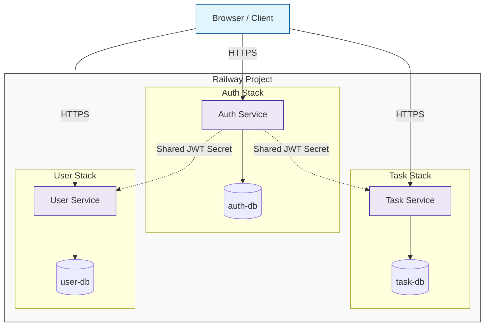

# ENGSE207 Software Architecture Final Lab Set 2

## ข้อมูลผู้จัดทำ (กลุ่ม S1-5)
1. นาย ธนมินทร์ เปลี่ยนพร้อม (รหัสนักศึกษา: 67543210032-8)
2. นางสาว รัฐจิกาลณ์ กวงคำ (รหัสนักศึกษา: 67543210063-3)

**Repository:** `https://github.com/PaNiNi005/engse207-final-lab2-675432100328-675432100633/tree/main`

---

## Cloud Service URLs (Railway)
| Service | Public URL (Production) |
| :--- | :--- |
| Auth Service | [ระบุ URL ของ Auth Service บน Railway ที่นี่] |
| Task Service | [ระบุ URL ของ Task Service บน Railway ที่นี่] |
| User Service | [ระบุ URL ของ User Service บน Railway ที่นี่] |

---

## การต่อยอดจาก Set 1 สู่ Set 2
ในโปรเจกต์ Set 2 นี้ เป็นการพัฒนาระบบต่อยอดจาก Set 1 โดยเปลี่ยนสถาปัตยกรรมจากรูปแบบเดิมให้มีความเป็น Microservices ที่สมบูรณ์ยิ่งขึ้น ดังนี้:
1. การขยาย Service: เพิ่ม User Service เพื่อจัดการข้อมูลโปรไฟล์ และเพิ่มระบบ Register API ใน Auth Service (ซึ่งใน Set 1 ไม่มี)
2. รูปแบบฐานข้อมูล: เปลี่ยนจากฐานข้อมูลที่ใช้ร่วมกัน (Shared Database) มาเป็นรูปแบบ Database-per-Service โดยแยกฐานข้อมูล 3 ชุดอิสระต่อกัน
3. ระบบ Cloud: ย้ายการ Deploy จากการรันผ่าน Docker ในเครื่อง Local ขึ้นสู่ระบบ Cloud จริงบน Railway Platform
4. การจัดการ Logging: เปลี่ยนจาก Log Service ส่วนกลาง มาเป็นการเขียน Log ลงในฐานข้อมูลของแต่ละ Service โดยตรง เพื่อลดความซับซ้อนของการสื่อสารข้าม Network บน Cloud

---

### Architecture Diagram (Cloud Version)

สถาปัตยกรรมระบบบน Railway ประกอบด้วย 3 Services และ 3 Databases ที่ทำงานแยกกันอิสระ:


---

## Gateway Strategy
กลุ่มของเราเลือกใช้ **Option A: Frontend Direct Call (Client-side Gateway)**
**เหตุผล:** เนื่องจากแต่ละ Service บน Railway มีการจัดการ HTTPS และมอบหมาย Public URL ให้โดยเฉพาะอยู่แล้ว การให้ Frontend เรียกใช้แต่ละ Service โดยตรงผ่านไฟล์ config.js จึงเป็นวิธีที่ตั้งค่าง่ายที่สุดสำหรับการส่งงานสอบ ลดความซับซ้อนในการจัดการ Proxy และช่วยลดความหน่วง (Latency) ในการเรียกใช้ API

---

## วิธีการรัน Local ด้วย Docker Compose
หากต้องการทดสอบระบบในสภาพแวดล้อม Local ให้ดำเนินการดังนี้:

1. Clone Repository นี้ลงเครื่อง
2. ตรวจสอบไฟล์ `.env` โดยอ้างอิงจาก `.env.example` และตรวจสอบว่าค่า `JWT_SECRET` ตรงกันทุก Service
3. ใช้คำสั่งเพื่อเริ่มต้นการทำงาน:
```bash
docker-compose up --build
```

---

### ระบบจะเปิด Port ดังนี้:

- Auth Service: 3001
- Task Service: 3002
- User Service: 3003

---

### Environment Variables ที่ใช้
การตั้งค่าที่สำคัญในทุก Service ทั้งบน Railway และ Local:

- **DATABASE_URL**: URL สำหรับเชื่อมต่อฐานข้อมูล PostgreSQL ของแต่ละ Service
- **JWT_SECRET**: รหัสลับสำหรับการตรวจสอบ Token (ต้องกำหนดให้ตรงกันทุก Service)
- **PORT**: พอร์ตที่ Service รัน (เช่น 3001, 3002, 3003)
- **NODE_ENV**: กำหนดสถานะเป็น production เมื่อรันบน Cloud
  
---

### วิธีการทดสอบด้วย curl (Cloud URLs)
*กรุณาเปลี่ยน [URL] เป็น URL จริงจากระบบ Railway ของกลุ่ม*

### 1. ทดสอบการสมัครสมาชิก (Register):
```bash
curl -X POST [AUTH_URL]/api/auth/register \
  -H "Content-Type: application/json" \
  -d '{"username":"clouduser","email":"cloud@test.com","password":"password123"}'
```

---

 ### 2. ทดสอบการเข้าสู่ระบบ (Login) เพื่อรับ Token:

```bash
TOKEN=$(curl -s -X POST [AUTH_URL]/api/auth/login \
  -H "Content-Type: application/json" \
  -d '{"email":"cloud@test.com","password":"password123"}' \
  | python3 -c "import sys,json; print(json.load(sys.stdin)['token'])")

echo "TOKEN: $TOKEN"
```

---

### 3. ทดสอบการดึงข้อมูล Profile (User Service):
```bash
curl [USER_URL]/api/users/me -H "Authorization: Bearer $TOKEN"
```

---

### 4. ทดสอบการสร้างงาน (Task Service):

```bash
curl -X POST [TASK_URL]/api/tasks \
  -H "Authorization: Bearer $TOKEN" \
  -H "Content-Type: application/json" \
  -d '{"title":"Test Cloud Task","priority":"high"}'
```
---

### Known Limitations

- **No Foreign Keys Across Databases**: เนื่องจากใช้ Database-per-Service จึงไม่มีการเชื่อมความสัมพันธ์ระดับฐานข้อมูลด้วย Foreign Key ระหว่างกัน
- **Logical Reference**: การระบุตัวตนผู้ใช้ในฐานข้อมูล Task และ User จะใช้วิธี Logical Reference ผ่าน user_id ที่ถอดมาจาก JWT Payload เท่านั้น
- **Logging**: Log ถูกจัดเก็บแยกตามฐานข้อมูลของแต่ละ Service ทำให้การตรวจสอบเหตุการณ์ในภาพรวมต้องไล่ดูจากฐานข้อมูลแต่ละตัวแยกกัน

---

### Screenshots

- **01_railway_dashboard.png**: Railway Project แสดง 3 services + 3 databases


- **02_auth_register_cloud.png**: POST register -> 201
- **03_auth_login_cloud.png**: POST login -> JWT token
- **04_auth_me_cloud.png**: GET /auth/me -> user info
- **05_user_me_cloud.png**: GET /users/me -> profile
- **06_user_update_cloud.png**: PUT /users/me -> อัปเดต
- **07_task_create_cloud.png**: POST /tasks -> 201
- **08_task_list_cloud.png**: GET /tasks -> task list
- **09_protected_401.png**: GET /tasks (ไม่มี JWT) -> 401
- **10_member_403.png**: GET /users (member) -> 403
- **11_admin_users_200.png**: GET /users (admin) -> 200
- **12_readme_architecture.png**: Architecture diagram ใน README
---
